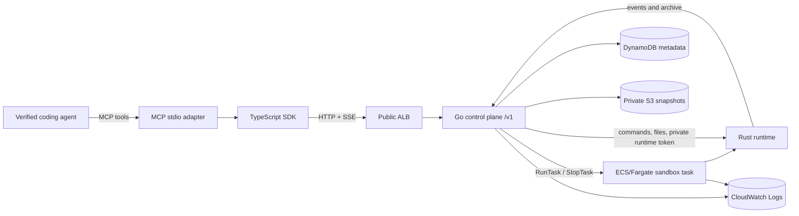

# Architecture

haedes gives an agent a temporary Linux computer. The agent owns planning and
tool selection; haedes owns the computer boundary, lifecycle, authorization,
process execution, filesystem isolation, and snapshot coordination.

## System and data flow

The public `/v1` HTTP API is the canonical contract. MCP, the SDK, and the
dashboard are clients of that contract. MCP never calls ECS, S3, DynamoDB,
CloudWatch, or the Rust runtime directly, and it does not maintain lifecycle
state.

## Ownership boundaries

| Boundary | Owns | Must not own |
| --- | --- | --- |
| Coding agent | Planning, repository edits, test decisions | AWS credentials, lifecycle state, host filesystem |
| MCP adapter | Stdio transport, tool schemas, input validation, safe results | AWS calls, persistence, model loop |
| Go control plane | `/v1`, auth, owner checks, lifecycle, ECS/S3/DynamoDB orchestration | Child processes or direct user filesystem access |
| Rust runtime | `/workspace`, child processes, limits, command events, archive import/export | Users, billing, AWS APIs, public identity |
| Terraform/AWS | Network, ECS, ECR, IAM, S3, DynamoDB, CloudWatch | Agent decisions or application state transitions |
| Dashboard | Human observation and control through `/v1` | Independent lifecycle or mock state |

See [ownership.md](ownership.md) for review rules and
[state-machine.md](state-machine.md) for the authoritative lifecycle diagram.

## Lifecycle and snapshot flow

1. The client sends `POST /v1/sandboxes` with an idempotency key.
2. The control plane authenticates the owner, records `requested`, launches
   one Fargate runtime task in a private subnet, and waits for `/healthz`.
3. ECS returns a private task endpoint. The control plane stores the task
   reference and a short-lived runtime token, then exposes `running`.
4. Commands and file operations are sent through the control plane. Runtime
   events are replayable SSE; the runtime never receives the public API key.
5. Snapshot export streams a bounded `/workspace` archive through the control
   plane to encrypted S3 and records checksum metadata in DynamoDB.
6. Destroy stops the task and transitions the sandbox to `destroyed`.
   Restore creates a new sandbox and imports the verified archive; it does not
   revive the old ECS task.

## Runtime limits

These are enforced at the public API and runtime boundaries:

| Resource | Limit |
| --- | ---: |
| Command input | 16 KiB |
| Command output | 1 MiB |
| Environment entries | 32 |
| Environment key/value | 256 / 4 KiB |
| File body | 10 MiB |
| Snapshot archive | 100 MiB |
| Command timeout | 900 seconds |
| Workspace directory entries | 10,000 |

`/workspace` is the only user filesystem root. Traversal, absolute paths,
symlink escapes, oversized bodies, and unbounded commands are rejected.
